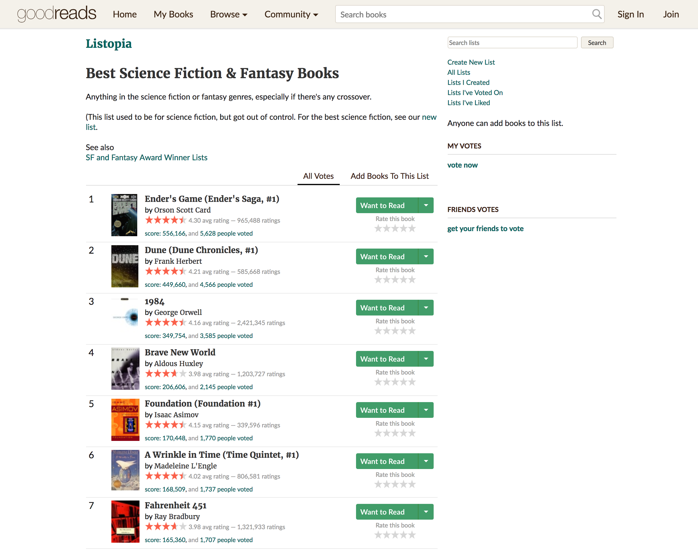
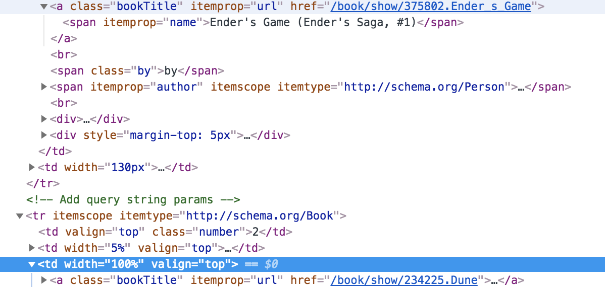
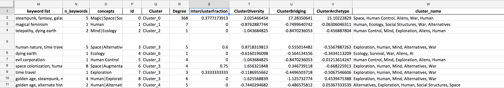
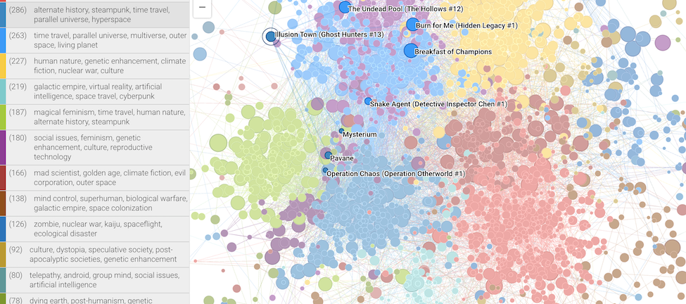
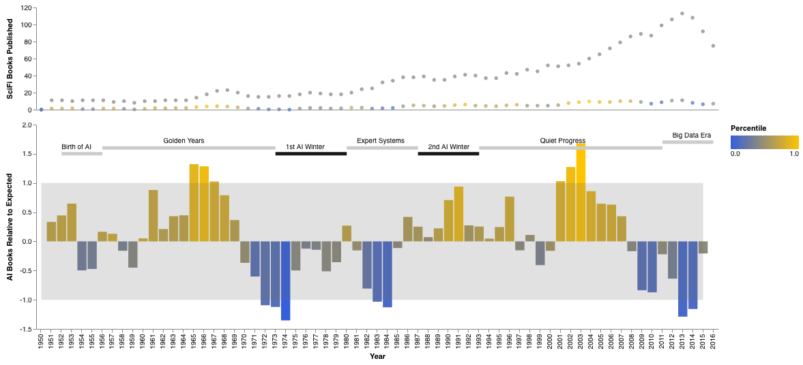

## Technical Introduction

In [The Shape Of Human Dreams](https://medium.com/@bethaniemaples/3a5d75f5d269), we explored how visualizing a network of science fiction books helps us uncover broad conceptual themes in the science fiction landscape. We can also identify books that most embody certain themes, as well as books that sit at the intersection of multiple themes.

In this post, we'll dive into the research and technical process that helped us produce the article. Here are the technical tools we use, that we recommend being familiar with:

- Python programming language, including the following libraries:
	- pandas (for interacting with dataframe objects)
	- requests (for making requests to web pages to be scraped)
	- BeautifulSoup (for scraping web pages)
	- json (for reading out scraped data)

The visualizations you see in the original post were captured from a live instance of the [openmappr](https://github.com/ericberlow/openmappr) tool which rendered an [interactive network visualization] (http://app.openmappr.org/play/100YrsOfSciFi) of our scraped and processed data on science fiction books.

The basic flow of our analytical pipeline included:

- Data Sources: Identifying a good data source of SciFi books
- Data Acquisition: Scraping the book data and metadata
- Data Cleaning: cleaning and formatting the data
- Data Enrichment: adding keywords and concepts for each book
- Network Generation: generating a network of books, linked if they share similar keywords, and clustered into keyword themes. 
- Network Visualization: visualizing and publishing the interactive network
- AI Trend Analysis: Identifying how trends in the publishing rate of books tagged with the concept, 'Artificial Intelligence,' related to the history of AI in society.


## Data Sources Research

Detailed, high quality data on science fiction books is hard to come by (especially since we wanted to focus on popular and culturally impactful science fiction books). Some questions we asked were:

- Which books do we want data on?
- What attributes are of these books are interesting for analysis and visualization?

We ended up settling on the **Best Science Fiction & Fantasy Books** list [on Goodreads](https://www.goodreads.com/list/show/3.Best_Science_Fiction_Fantasy_Books).



This Goodreads list contained links to the 6000+ "best" science fiction and fantasy books. The list was created in 2008, but since we wanted to focus on books in the 1800-1900s mostly, this was fine. Anecdotally, Bethanie and I were familiar with many books on the list (which provided some basic validation that these books were popular).

We also explored Wikipedia lists [like this one on science fiction novels](https://en.wikipedia.org/wiki/Category:Science_fiction_novels), but we realized that we would have to do a lot more manual curation ourselves afterwards (or some kind of complex natural language processing to try to estimate impact & popularity). The Goodreads list not only provided curation, it also provided a rich corpus of user reviews for each books that we could parse for identifying themes. 

However, we'd love to incorporate Wikipedia data in a future iteration (especially using the content on [science fiction themes](https://en.wikipedia.org/wiki/List_of_science_fiction_themes)).

## Data Acquisition

The first step in any web scraping project is to become very familiar with the URL patterns and the HTML patterns. Some relevant questions include:

- Are the URL's for each page in the list consistent and predictable? 
- Is the HTML code in each list that describes the URL's for individual book pages consistent?
- What data can we reliably grab from each book pages?

These questions help us understand what data we can grab reliably because we can easily express those patterns in code. You can follow along by reading the entire scraper code as a Jupyter notebook [on Github](https://github.com/ericberlow/SciFi/blob/master/scraper_documentation.ipynb). 

### Page URL's

Here's how the URLs for each page in the list is structured:

- First Page URL: https://www.goodreads.com/list/show/3.Best_Science_Fiction_Fantasy_Books?page=1
- Second Page URL: https://www.goodreads.com/list/show/3.Best_Science_Fiction_Fantasy_Books?page=2
- ...
- N page url: https://www.goodreads.com/list/show/3.Best_Science_Fiction_Fantasy_Books?page=n

We can easily express this as a pattern by using the base string:

```python
base_url = "http://www.goodreads.com/list/show/3.Best_Science_Fiction_Fantasy_Books"
```

Then we can append the page number dynamically:

```python
page_url = base_url + "?page=" + str(page_num)
```

We could wrap this in a function and call it for every page number (`1` to `n`). Here's what that code ended up looking like:

```python
from bs4 import BeautifulSoup
import pandas as pd
import requests
import time
import csv
import json
import lxml

def fetch_scifi_novels(page_num):
    print("Fetching top level page ", str(page_num))
    base_url = "http://www.goodreads.com/list/show/3.Best_Science_Fiction_Fantasy_Books"
    page_url = base_url + "?page=" + str(page_num)
    r = requests.get(page_url)
    soup = BeautifulSoup(r.content, "lxml")
    # Returns BeautifulSoup object for the first 
    return(soup)
```

The above code grabs the HTML representation of a page in the [original list](https://www.goodreads.com/list/show/3.Best_Science_Fiction_Fantasy_Books?page=1) and returns it as a [BeautifulSoup object](https://www.crummy.com/software/BeautifulSoup/bs4/doc/#kinds-of-objects). Once we have a HTML page as a BeautifulSoup object, we can call functions on that object to extract specific HTML values.

### Book Page URL's

Once we have the BeautifulSoup representation of a page, we can write another function that returns the URL for each book as a list. After some sleuthing around in the [Google inspect tool](https://developers.google.com/web/tools/chrome-devtools/inspect-styles/). we determined that book URL's are written as `<a>` tags with `class='bookTitle'`. Here's what the first 2 URL's look like in the HTML code:



Here's the function we wrote to extract all book URL's from a page.

```python
def parse_book_urls_from_page(current_page):
    current_page_books = current_page.find_all('a', attrs={'class': 'bookTitle'})
    
    # Parse the Goodreads book URL's and append to this list:
    current_page_book_links = []

    for book_a in current_page_books:
        link = book_a.get('href')
        full_link = "http://www.goodreads.com" + link
        current_page_book_links.append(full_link)
    # Returns list of book URLS.
    return(current_page_book_links)
```

The above function returns a list of book page URL's like so:

```python
[
    "https://www.goodreads.com/book/show/375802.Ender_s_Game",
    "https://www.goodreads.com/book/show/234225.Dune",
    ...
]
```

We continued this research and codification until we had written the following functions:

- `parse_genre_page(genre_url)`: helper function that returns tagged genres from Goodreads for a given book.
- `parse_books(book_urls)`: main, meaty function that accepts a list of book URL's and, for each URL:
	- fetches the HTML representation of the page, converting to a BeautifulSoup object
	- grabs the following attributes:
		- number of reviews
		- reviews on the first page of the book page
		- tagged genres
		- plot
		- author
		- published date

Here's the glue code that ties all of the functions together and exports the data as JSON files.

```python
for i in range(1, 65):
    page_soup = fetch_scifi_novels(i)
    page_links = parse_book_urls_from_page(page_soup)
    final_results = parse_books(page_links)
    filename = "page_" + str(i) + ".json"

    with open(filename, "w") as f:
        json.dump(final_results, f, indent=2)
```

## Data Cleaning

One downside of working with scraped data is the dearth of inconsistencies that prop up. While we think of web content as structured or even [semantic](https://en.wikipedia.org/wiki/Semantic_Web), when doing data analysis there are often data quality issues (Goodreads never promised it they would make it easy!). We wrote a [separate script](https://github.com/ericberlow/SciFi/blob/master/prepSciFiData_json.py) that:

- reads in the JSON data from the earlier step
- standardizes format for publishing year (important to clean since we'll be doing many time based visualizations)
- converts the data into a dataframe object
- saves the dataframe object as a TSV file

## Data Enrichment

We now have a cleaned dataset of thousands of science fiction books, including information on:

- author
- year published
- number of reviews
- plot description
- user generated tags
- reviews

Our next goal was to enrich each book with keyword and concept tags. In an ideal world, we could use [natural language processing](https://en.wikipedia.org/wiki/Natural_language_processing) to automatically extract themes from the book descriptions and reviews, but this is difficult for the following reasons:

- the plot often has very little information about the broader concepts that the book addresses
- while the reviews do have useful interpretive language, they also have lots of irrelevant language

Similarly, the user-generated tags include important concepts (e.g., "Artificial Intelligence"), but also contain an over-abundance of uninformative terms like "Books I Own". 

To overcome these challenges we used the [`runSciFi\_kwds\_network.py`](https://github.com/ericberlow/SciFi/runSciFi_kwds_network.py) script to enrich books with a human curated list of keywords and concepts. This script:

- reads in a [dictionary](https://github.com/ericberlow/SciFi/blob/master/scifi_syndic_conceptdic.xlsx) of search phrases mapped to science fiction keywords and concepts:
	- 	e.g., If a review mentioned "general artificial intelligence", the book is tagged with the keyword, "sentient AI", and the broader concept "AI". 
- uses the `buildKeywords()` function from the [`BuildKeywords.py`](https://github.com/foodwebster/Tag2Network/blob/master/tag2network/Tags/BuildKeywords.py) script of the [tag2network](https://github.com/foodwebster/Tag2Network) open source package to:
	- read in a master keyword list and a keyword dictionary. 
	- parse all the text (plot summary, reviews, and user-generated tags) into 1-, 2-, 3-grams
	- add keywords to a book from the keyword dictionary if the keyword, or any related synonyms and search terms, were present in the text.
- then we tag books with concepts using the keyword to concept dictionary and remove the large block of text to reduce the file size. 

## Network Generation

Now that we have tagged each book with a curated set of keywords and concepts, we want to find themes - which we define as groups of books that tend to share similar sets of keywords. To do this we used a network approach to 'topic modeling' that links books with similar keywords, and finds emegent clusters of similar books. This happens in the  [`runSciFi_kwds_network.py`](https://github.com/ericberlow/SciFi/runSciFi_kwds_network.py) script, where we use the `buildTagNetwork` function from the [`BuildNetwork.py`](https://github.com/foodwebster/Tag2Network/blob/master/tag2network/Network/BuildNetwork.py) script of the [tag2network](https://github.com/foodwebster/Tag2Network) library. This script:

- computes the keyword similarity of each book to every other book using cosine similarity. 
	- In the similarity computation, we used the option to down-weight the importance of keywords that were extremely common (this is referred to as 'IDF' for 'Inverse Document Frequency').
- the resulting similarity matrix is then 'sparsified', or thinned, to create a network of books linked to their most similar neighbors.
- book clusters are computed using the louvain community detection method, which is an unsupervized machine learning algorithm that finds groups of nodes that are more connected to each other than to the rest of the network.  When the links are similarity, this results in identifying clusters of books that are more similar to one another (in their keywords) than to the rest of the books. 
- the clusters are then auto-labeled by the most characteristic keywords in the group - where keywords are considered more characteristic if they are both locally common and globally rare.  
- the final network is exported as an excel file with 2 sheets. The 'nodes' sheet is the original list of books, enriched with network metrics like cluster identity.  The 'links' sheet is a list of book pairs which are linked. 

Finally, we 'decorated' the network with the [`decorateSciFi.py`](https://github.com/ericberlow/SciFi/blob/master/decorateSciFi.py) script by adding a few extra attributes to each book, like a flag for whether or not it was tagged with the 'AI' concept, and which time period in the history of AI that it was published.

Here's a preview of the final `.xlsx` network file, containing the information on the network:




## Network Visualization Using Openmappr

The `.xlsx `network file described above is in a format to upload into [openmappr](https://openmappr.org) - an open source tool for interactive network exploration. We used openmappr to:

- style the network (i.e, node colors, sizes, layouts, and filtering options)
- save multiple views (different layouts and coloring schemes)
- publish the network (and all the saved views) to a custom url [app.mappr.io/play/100YrsOfSciFi](http://app.mappr.io/play/100YrsOfSciFi). 
 


## AI Trends

Now that we have bookes tagged with a curated set of keywords and concepts, we decided to focus on books tagged with Artificial Intelligence. We were interested to know if there was any link between AI funding and interest in the academic research circles and the science fiction publishing world. For example, did science fiction authors continue to publish books that envision an AI future even during known 'AI winters' when AI research was not living up to the hype and public funding was low?  Since the total number of science fiction books published increased over time (see figure below) we wanted to know if the fraction of AI books published in any given time period was unusually high or low. To get a meeasure of how much is "unusual" relative to what you might expect by chance, we estimated a [z-score](https://en.wikipedia.org/wiki/Standard_score) for the fraction of AI books each year. This was all accomplished with the [`get_plot_AI_zScores.py`](https://github.com/ericberlow/SciFi/blob/master/get_plot_AI_zScores.py) script which does the following: 

- Summarizes total books and fraction of AI books per year.

- Smooths the trend with a 3 yr rolling average of the fraction AI books per year 
	- (This helps address the fact that a) the time period definitions in AI history have some inherent slop, and b) there is some lag between the time an author was writing a book and the year it was published)
- Computes a sampled z-score for the rolling average fraction of AI books in each year. 
	- This addresses the questions: Was the observed fraction AI books published that year surprisingly high or low relative to what you would expect by chance for a sample of books that size. For example, if 20 science fiction books were published that year, and 4 were tagged AI, how often does that happen if we randomly sample 20 books from the entire set, and do that 1000 times?
	- We accmoplished this by randomly sampling the observed number of books for a given year from the entire dataset computing the fraction AI books per sample, and repeating that 1000 times to get a distribution of the expected fraction AI books for that sample size. 
	- The z_score is then computed as how many standard deviations from the expected mean is the observed value.
	- We then compute, for each year what % of random trials was the fraction of AI books less than the observed value - this gives the percentile score of AI publishing frequency for each year.
	- the function for doing this randomly sampled z-score is below: 

```python
def get_sampled_zscore (group, df=df, attr='AI',niter=1000):
    sample_frac_list = []
    nbooks = group['roll_n_books'].values[0] # rolling mean of total books for the year
    obs_frac = group['roll_frac_AI'].values[0] # rolling mean of frac books for the year
    for i in range (0, niter):
        if nbooks > 0:
        	# get random sample of same size as the group
            smpl_df = df.sample(nbooks) 
            # get frac ai books in the sample
            smpl_frac_ai = get_frac(smpl_df, attr=attr) 
            # compile list of frac_ai for all samples
            sample_frac_list.append(smpl_frac_ai) 
       else:
            # get frac ai books in the sample
            smpl_frac_ai = np.nan 
            # compile list of frac_ai for all samples
            sample_frac_list.append(smpl_frac_ai) 
	#convert list of sample fracs to series
    sample_fracs = pd.Series(sample_frac_list).sort_values() 
    # get percentile of observed value
    group['pctl_frac_'+attr] = sample_fracs.searchsorted(obs_frac)[0]/len(sample_fracs)
    # compute mean frac ai for 1000 samples
    mean_smpl_frac = sample_fracs.mean() 
    # compute standard deviation of the frac ai for the 1000 samples
    std_smpl_frac = sample_fracs.std() 
    # compute zscore of observed group frac ai (zscore = (obs-mean)/std)
    group['z_frac_'+attr] = compute_zscore(obs_frac, mean_smpl_frac, std_smpl_frac)     
 	return group  #returns a dataframe with new computed cols added to original ones

# group by year and compute scores 
zdf = yrdf.groupby(['year']).apply(get_sampled_zscore) # adds extra computed columns to original ones. 

```


Finally the [`get_plot_AI_zScores.py`](https://github.com/ericberlow/SciFi/blob/master/get_plot_AI_zScores.py) script uses the [Altair](https://altair-viz.github.io/) visualization package to plot the trends:



In this plot, the upper panel is shows the 3-year rolling average of the number of science fiction books published each year. The grey dots are the total number of books, and the colored dots are books tagged AI. The lower panel shows, for each year the z-score of the fraction of total books that were tagged AI. The yellow (and blue) bars are years where the AI publishing rate was higher (or lower) than average of 1000 random samples of the same number of books published that year. The intensity of blue and yellow is the percentile of the observed value - so more intense means that the observed fraction AI books was unusually high (intense yellow) or low (intense blue). The grey band is 1 standard deviation from the mean fraction AI books of 1000 random samples for any given year. Above the bars is a rough timeline of major periods in the [history of Artificial Intelligence](https://en.wikipedia.org/wiki/History_of_artificial_intelligence).

There are some interesting patterns suggested by this chart:

- Science fiction publishing foreshadowed the AI winter:
	- While there was a healthy clip of AI themed books in the Golden Years, there was a steep decline relative to expected leading up to - and right as- the 1st AI winter hit. The lack of interested continued through the 'Expert Systems' time period when AI focused on expert logic, rather than machine learning. 
- Science fiction publishined foreshadowed the recent AI boom during a time when AI was very low profile in the general public, but making clear progress under other names. 
	- In other words, during early 2000’s - when "artificial intelligence" had a bad reputation, and AI researchers deliberately used other names to describe their work, sci fi writers were perhaps paying attention to the trends and successes in machine learning that were less obvious to the general public. 
- In recent years, there is a surprising trend for AI publishing rates to be lower than expected - perhaps the Science Fiction community is already bored with it and onto new things? 

